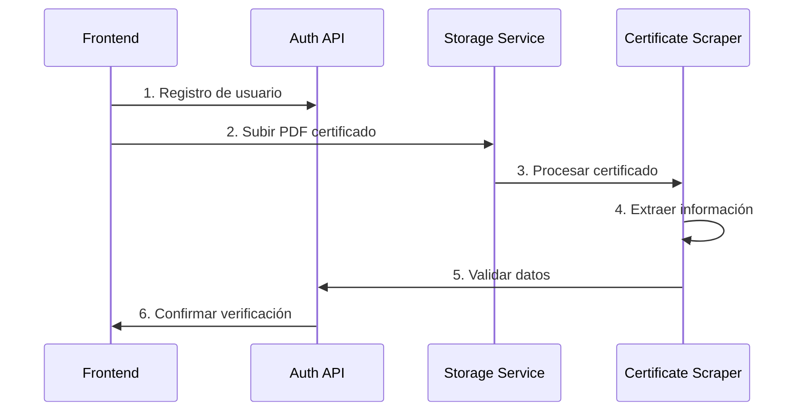
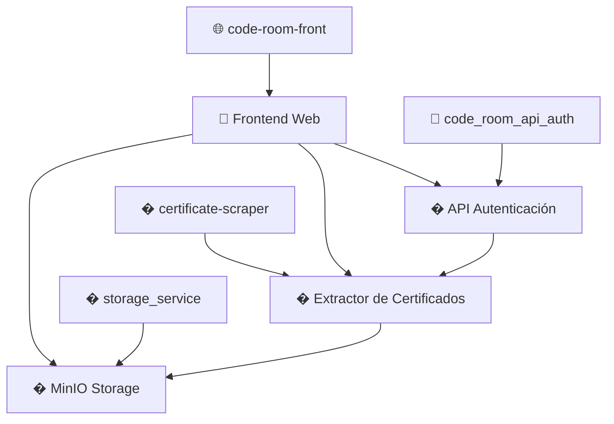

# 🏠 Code Room Frontend - v1.0.0

> **Plataforma de arriendo seguro para estudiantes universitarios en Chile**

[](https://nextjs.org/)
[_

- **📍 Ubicación**: `C:\Users\ivand\OneDrive\Escritorio\code-room-front`
- **🎯 Propósito**: Interface de usuario web
- **🔧 Función**: Frontend React/Next.js con UI completa
- **📡 Estado**: v1.0.0 (Estática) - Preparada para integración
- **🔗 Integración**: Consumirá todos los microservicios en v2.0.0

## 🔄 Flujo de Integración v2.0.0

### Pipeline de Verificación de Estudiantes



### Endpoints de Integración Planificados

typescript
// Frontend → Auth API
POST /api/auth/register
POST /api/auth/login

// Frontend → Storage Service
POST /api/storage/upload-certificate
GET /api/storage/files/:userId

// Certificate Scraper → Auth API
POST /api/certificates/validate
GET /api/certificates/extract-info
mg.shields.io/badge/React-19-blue)](https://reactjs.org/)
[](https://www.typescriptlang.org/)
[](https://tailwindcss.com/)

## 📋 Descripción

**Code Room** es una plataforma web moderna que conecta estudiantes universitarios con propietarios verificados para encontrar arriendo seguro y confiable en Chile. La aplicación fue generada inicialmente con **v0.dev de Vercel** y se encuentra en su **versión 1 (estática)**, preparándose para la integración con el ecosistema backend completo.

### 🎯 Características Principales

- ✅ **Sistema de autenticación** diferenciado (Estudiantes/Propietarios)
- ✅ **Verificación de documentos** (Certificados estudiantiles/Dominio)
- ✅ **Búsqueda avanzada** de propiedades con filtros
- ✅ **Perfiles personalizados** para cada tipo de usuario
- ✅ **Chat integrado** para comunicación directa
- ✅ **Interface responsive** y moderna
- ✅ **Sistema de propiedades** verificadas

## 🛠️ Stack Tecnológico

### Frontend Core

json
{
"framework": "Next.js 15.2.4 (App Router)",
"runtime": "React 19",
"language": "TypeScript 5",
"styling": "Tailwind CSS 3.4.17"
}

### UI/UX Framework

```json
{
  "components": "Radix UI + shadcn/ui",
  "icons": "Lucide React",
  "animations": "tailwindcss-animate",
  "themes": "next-themes",
  "notifications": "Sonner"
}
```

### Funcionalidades Específicas

```json
{
  "forms": "React Hook Form + Zod",
  "charts": "Recharts 2.15.0",
  "dates": "date-fns + react-day-picker",
  "carousel": "Embla Carousel React",
  "modals": "Vaul + Radix Dialog",
  "panels": "react-resizable-panels"
}
```

## 📁 Estructura del Proyecto

```
code-room-front/
├── 📂 app/                 # App Router (Next.js 13+)
│   ├── 🏠 page.tsx         # Landing Page
│   ├── 🔐 login/           # Autenticación
│   ├── 📝 register/        # Registro de usuarios
│   ├── 🔍 search/          # Búsqueda de propiedades
│   └── 👤 profile/
│       ├── 🎓 student/     # Dashboard estudiante
│       └── 🏘️ landlord/    # Dashboard propietario
├── 📂 components/
│   ├── 🎨 ui/              # Componentes reutilizables
│   └── 🌙 theme-provider.tsx
├── 📂 hooks/               # Custom React hooks
├── 📂 lib/                 # Utilidades y helpers
└── 📂 public/              # Assets estáticos
```

## 🚀 Instalación y Desarrollo

### Prerrequisitos

- **Node.js** 18+
- **pnpm** (recomendado) o npm
- **Git**

### Configuración Local

```bash
# Clonar el repositorio
git clone [repository-url]
cd code-room-front

# Instalar dependencias
pnpm install

# Ejecutar en modo desarrollo
pnpm dev

# Abrir en el navegador
# http://localhost:3000
```

### Scripts Disponibles

```bash
# Desarrollo
pnpm dev          # Servidor de desarrollo

# Producción
pnpm build        # Build optimizado
pnpm start        # Servidor de producción

# Calidad de código
pnpm lint         # ESLint
```

## 🎨 Tema y Diseño

### Paleta de Colores

```css
:root {
  --sage: #8fbc8f; /* Verde salvia (primario) */
  --cream: #cdc1a5; /* Crema (fondo suave) */
  --neutral: #374151; /* Grises para texto */
}
```

### Características de Diseño

- 📱 **Mobile-first** responsive design
- 🌙 **Modo oscuro/claro** con next-themes
- ✨ **Efectos modernos** (backdrop blur, gradientes)
- ♿ **Totalmente accesible** (Radix UI)
- 🎯 **UX optimizada** para estudiantes y propietarios

## 📄 Páginas y Funcionalidades

| Página                    | Ruta                | Descripción                                    | Estado      |
| ------------------------- | ------------------- | ---------------------------------------------- | ----------- |
| 🏠 **Landing**            | `/`                 | Página principal con información del servicio  | ✅ Completa |
| 🔐 **Login**              | `/login`            | Autenticación de usuarios                      | ✅ Completa |
| 📝 **Registro**           | `/register`         | Registro diferenciado (estudiante/propietario) | ✅ Completa |
| 🔍 **Búsqueda**           | `/search`           | Listado y filtrado de propiedades + chat       | ✅ Completa |
| 🎓 **Perfil Estudiante**  | `/profile/student`  | Dashboard del estudiante                       | ✅ Completa |
| 🏘️ **Perfil Propietario** | `/profile/landlord` | Gestión de propiedades                         | ✅ Completa |

## 🔧 Estado Actual (v1 - Estática)

### ✅ Implementado en Frontend

- [x] Interface de usuario completa
- [x] Navegación entre páginas
- [x] Formularios con validación (frontend)
- [x] Diseño responsive
- [x] Componentes reutilizables
- [x] Chat simulado (mockup)
- [x] Sistema de perfiles (UI)
- [x] Gestión de propiedades (UI)
- [x] Subida de archivos (UI preparada)

### 🔄 Microservicios Desarrollados

- ✅ **code_room_api_auth** - API de registro y autenticación
- ✅ **certificate-scraper-service** - Extractor de certificados PDF
- ✅ **storage_service** - Almacenamiento MinIO para archivos
- 🔄 **Pipeline de Validación** - Flujo completo de verificación de estudiantes

### 🚧 Próximas Integraciones (v2)

- [ ] **API de Autenticación** - Integración con `code_room_api_auth`
- [ ] **Validación de Certificados** - Conexión con `certificate-scraper-service`
- [ ] **Almacenamiento de Archivos** - Integración con `storage_service` (MinIO)
- [ ] **Verificación Automática** - Pipeline completo de validación de documentos
- [ ] **Chat en tiempo real** - WebSockets para comunicación
- [ ] **Mapas interactivos** - Geolocalización de propiedades
- [ ] **Notificaciones push** - Sistema de alertas
- [ ] **Pagos integrados** - Pasarela de pagos

## 🌐 Ecosistema Code Room

Esta aplicación frontend está diseñada para integrarse con el ecosistema completo de Code Room:



### Microservicios del Ecosistema

#### 🔐 **code_room_api_auth**

- **� Ubicación**: `C:\Users\ivand\OneDrive\Escritorio\code_room_api_auth`
- **🎯 Propósito**: API de autenticación y registro general
- **🔧 Función**: Maneja el registro de usuarios (estudiantes/propietarios)
- **📡 Endpoint Principal**: Registro general de usuarios
- **🔗 Integración**: Recibe datos del frontend para crear cuentas

#### 📄 **code_room_certificate-scraper-service**

- **📍 Ubicación**: `C:\Users\ivand\OneDrive\Escritorio\code_room_certificate-scraper-service`
- **🎯 Propósito**: Extractor inteligente de información de certificados
- **🔧 Función**: Procesa PDFs de certificados estudiantiles y extrae información
- **📡 Endpoint Clave**: Análisis de URLs obtenidas desde certificados PDF
- **🔗 Integración**: Valida automáticamente la información estudiantil

#### 💾 **code_room_storage_service**

- **� Ubicación**: `C:\Users\ivand\OneDrive\Escritorio\code_room_storage_service`
- **🎯 Propósito**: Servicio de almacenamiento de archivos
- **🔧 Función**: API de MinIO para gestión de archivos PDF
- **📡 Endpoint Principal**: Almacenamiento seguro de certificados estudiantiles
- **🔗 Integración**: Guarda documentos subidos desde el frontend

#### � **code-room-front** _(Este Proyecto)_

- **📍 Ubicación**: `C:\Users\ivand\OneDrive\Escritorio\code-room-front`
- **🎯 Propósito**: Interface de usuario web
- **🔧 Función**: Frontend React/Next.js con UI completa
- **📡 Estado**: v1.0.0 (Estática) - Preparada para integración
- **🔗 Integración**: Consumirá todos los microservicios en v2.0.0

## 🤝 Contribución

### Flujo de Desarrollo

1. **Fork** del repositorio
2. **Branch** para nueva funcionalidad: `git checkout -b feature/nueva-funcionalidad`
3. **Commit** con mensajes descriptivos
4. **Push** y crear **Pull Request**

### Estándares de Código

- ✅ TypeScript estricto
- ✅ ESLint + Prettier
- ✅ Conventional Commits
- ✅ Componentes documentados

## 📝 Licencia

Este proyecto está bajo la licencia **MIT**. Ver `LICENSE` para más detalles.

## 👥 Equipo

- **Desarrollador Principal**: Ivan D.
- **Arquitectura**: Microservicios distribuidos
- **Frontend**: Next.js + TypeScript + Tailwind (v0.dev)
- **Backend**: Node.js APIs + MinIO Storage
- **Especialización**: Extracción inteligente de certificados PDF

## 📞 Contacto y Soporte

- 📧 **Email**: [ivan.dev@coderoom.cl]
- 🐛 **Issues**: [GitHub Issues por repositorio]
- 📖 **Documentación**: [Code Room Wiki]
- 🔧 **Microservicios**: 4 servicios independientes en desarrollo

---

<div align="center">

**🏠 Code Room v1.0.0** - _Conectando estudiantes con hogares seguros_

Hecho con ❤️ para la comunidad estudiantil chilena

</div>
